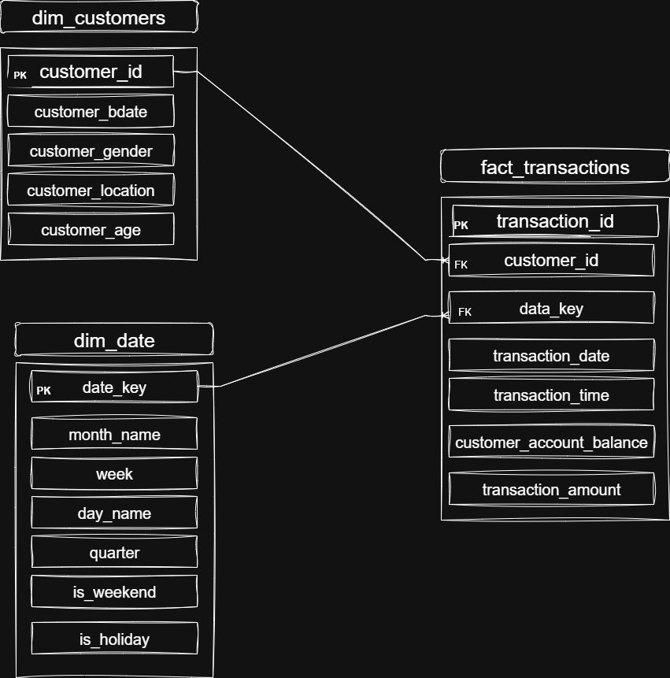

# Banking Transactions Analysis Project 🏦

## Overview
This project focuses on a high-capacity analysis of a massive banking dataset, processing 1 million individual transactions. The objective is to extract mission-critical business insights, stress-test system reliability under heavy loads, and decode complex customer spending behaviors. By leveraging advanced data modeling, the analysis uncovers precise patterns in transaction flow and operational performance across the entire dataset, providing a clear roadmap for system optimization and financial growth.

**Dataset Source:** [Kaggle - Bank Customer Segmentation](https://www.kaggle.com/datasets/shivamb/bank-customer-segmentation/data?select=bank_transactions.csv)

---

## Project Map

*(Note: This image illustrates the data flow and the relationship between dimensions and fact tables).*

---

## SQL Scripts Breakdown

### 1. `01_create_database.sql`
* **Database schema setup.**
* Definitions for Fact and Dimension tables (Transactions, Date, Customers, etc.).

### 2. `02_insert_data.sql`
* **Data ingestion process.**
* Handling the 15% sampled records from the `bank_transaction.csv` file.

### 3. `03_eda.sql` (Exploratory Data Analysis)
* **Initial data discovery.**
* Calculating total volumes, transaction counts, and general statistics.

### 4. `04_date_analysis.sql`
* **Deep dive into time-based trends** (Daily/Hourly).
* Analyzing peak days (15th of the month) and high-value days (21st).
* Customer segmentation (Early vs. Late captured users based on sampling window).

### 5. `05_system_reliability.sql`
* **Analyzing system stability** and failure proxies (Zero-amount transactions).
* Identifying peak-load bottlenecks (e.g., Sept 1st stress point) and maintenance windows.

---

## Key Findings Summary
* **Exceptional Stability:** The system maintains a **99.92% success rate**.
* **Zero Repeat Failures:** No single customer experienced more than one failure, indicating high system integrity and reliability.
* **Peak Liquidity:** The **15th of the month** is the highest volume day (73.5M INR), driven by mid-month payroll cycles.
* **High-Value Segments:** Transactions on the **21st of the month** have the highest average transaction value, despite lower volume.
* **Stress Point Identified:** A micro-outage was detected on **Sept 1st at 11:00 AM**, correlating with peak monthly traffic.

---

## Technical Notes
* **Data Availability:** The raw CSV file is not uploaded to this repository due to its large size. Please refer to the Kaggle link above to download the dataset.
* **Sampling Bias:** Due to the 15% sampling and data cut-off (Aug 1st), the "New Customer" segmentation is used for **relative comparison** within the sample.
* **Inferred Status:** Since no explicit status column exists in the original data, system reliability was measured using **zero-amount transactions** as a proxy for failed records.

**Dataset Source:** [Kaggle - Bank Customer Segmentation](https://www.kaggle.com/datasets/shivamb/bank-customer-segmentation/data?select=bank_transactions.csv)

---

## Project Map

*(Note: This image illustrates the data flow and the relationship between dimensions and fact tables).*

---

## SQL Scripts Breakdown

### 1. `01_create_database.sql`
* **Database schema setup.**
* Definitions for Fact and Dimension tables (Transactions, Date, Customers, etc.).

### 2. `02_insert_data.sql`
* **Data ingestion process.**
* Handling the 15% sampled records from the `bank_transaction.csv` file.

### 3. `03_eda.sql` (Exploratory Data Analysis)
* **Initial data discovery.**
* Calculating total volumes, transaction counts, and general statistics.

### 4. `04_date_analysis.sql`
* **Deep dive into time-based trends** (Daily/Hourly).
* Analyzing peak days (15th of the month) and high-value days (21st).
* Customer segmentation (Early vs. Late captured users based on sampling window).

### 5. `05_system_reliability.sql`
* **Analyzing system stability** and failure proxies (Zero-amount transactions).
* Identifying peak-load bottlenecks (e.g., Sept 1st stress point) and maintenance windows.

---

## Key Findings Summary
* **Exceptional Stability:** The system maintains a **99.92% success rate**.
* **Zero Repeat Failures:** No single customer experienced more than one failure, indicating high system integrity and reliability.
* **Peak Liquidity:** The **15th of the month** is the highest volume day (73.5M INR), driven by mid-month payroll cycles.
* **High-Value Segments:** Transactions on the **21st of the month** have the highest average transaction value, despite lower volume.
* **Stress Point Identified:** A micro-outage was detected on **Sept 1st at 11:00 AM**, correlating with peak monthly traffic.

---

## Technical Notes
* **Data Availability:** The raw CSV file is not uploaded to this repository due to its large size. Please refer to the Kaggle link above to download the dataset.
* **Sampling Bias:** Due to the 15% sampling and data cut-off (Aug 1st), the "New Customer" segmentation is used for **relative comparison** within the sample.
* **Inferred Status:** Since no explicit status column exists in the original data, system reliability was measured using **zero-amount transactions** as a proxy for failed records.

