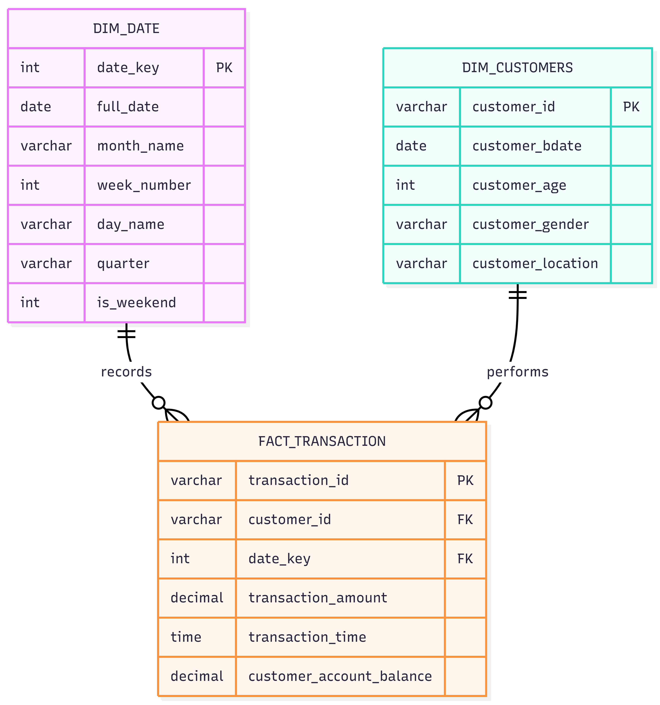

## 📊 Overview

This project is a high-scale banking data analytics system built using SQL Server.  
It processes over **1 million financial transactions** to extract actionable insights, evaluate system reliability, and analyze customer behavior patterns.

The project is designed as an **end-to-end data pipeline**, covering:
- Data engineering (database design, ingestion, cleaning, and data quality checks)
- Advanced analytics (EDA, time-based analysis, fraud detection, and system reliability)

The goal is to simulate a real-world banking analytics environment and identify operational and financial patterns that support business decision-making.

---

**Dataset Source:** [Kaggle - Bank Customer Segmentation](https://www.kaggle.com/datasets/shivamb/bank-customer-segmentation/data?select=bank_transactions.csv)

---

## 📁 Project Structure

### 🏗️ Data Engineering Layer

Responsible for building, preparing, and validating the data.

- `01_create_database.sql` → Database schema creation (Fact & Dimension tables)
- `02_insert_data.sql` → Data ingestion from raw banking dataset
- `03_data_cleaning.sql` → Data cleaning and standardization process
- `data_quality_issues.md` → Documented data inconsistencies and issues
- `map.png` → Data model / architecture diagram

---

## Project Map

### 📊 Data Analytics Layer

Responsible for extracting insights and generating business intelligence.

- `01_eda.sql` → Exploratory Data Analysis (transaction overview, distributions, KPIs)
- `02_system_reliability.sql` → System stability, failures, and performance analysis
- `03_time_based_analysis.sql` → Transaction trends over time (daily, hourly, monthly patterns)
- `04_fraud_detection.sql` → Suspicious behavior detection and anomaly analysis
- `insight.md` → Final business insights and key findings

---

## 🎯 Objectives

- Design a scalable banking database structure
- Process and clean large-scale transactional data (1M+ records)
- Perform exploratory and advanced SQL analytics
- Analyze system reliability under heavy transaction loads
- Detect potential fraud patterns and anomalies
- Identify time-based financial trends and customer behavior patterns

---

## 🛠️ Tools & Technologies

- SQL Server
- Data Warehousing Concepts (Fact & Dimension Modeling)
- Data Cleaning & Transformation Techniques
- Analytical SQL (Aggregations, Window Functions, Time-Series Analysis)
- Business Intelligence Thinking

---

## 📌 Key Insights

- 🟢 **System Stability:** 99.92% transaction success rate indicates strong reliability
- 🔁 **Failure Behavior:** No repeated customer failures detected, suggesting stable processing logic
- 💰 **Peak Liquidity Day:** 15th of the month shows highest transaction volume (salary-driven cycle)
- 📈 **High-Value Transactions:** 21st of the month shows highest average transaction value
- ⚠️ **System Stress Event:** A micro-outage detected on Sept 1st during peak traffic hours (11:00 AM)

---

## ⚠️ Dataset Limitations

- Customer attributes (DOB, Gender, Location) show inconsistencies across transactions
- Likely synthetic data generation artifacts
- Analysis is primarily transaction-level; customer-level insights should be interpreted with caution

---

## 👤 Author

Rashad – Finance & Investment Student | Data Analytics & BI Enthusiast
